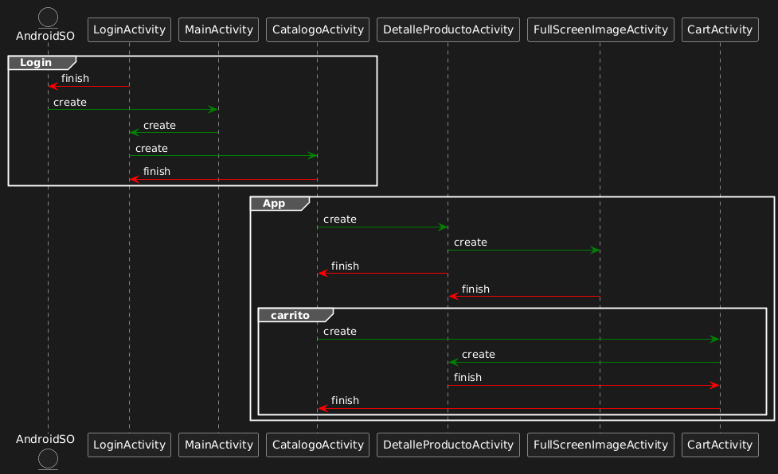
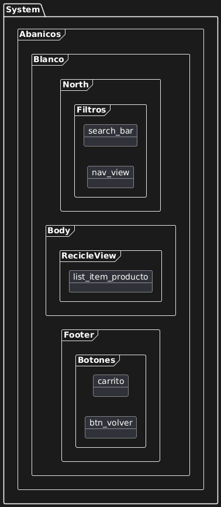
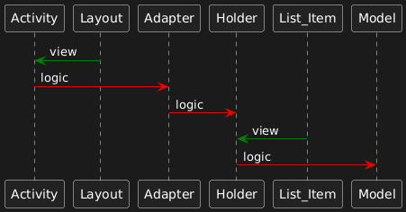

# 🚙 JeepPlaiaundi - Documentación Técnica Android

## 📖 Descripción General
**JeepPlaiaundi** es una aplicación nativa de Android diseñada como catálogo digital y plataforma de comercio electrónico. El proyecto permite a los usuarios navegar por una colección de productos, consultar detalles técnicos y gestionar un carrito de compras.

La aplicación ha sido desarrollada siguiendo los estándares de diseño de Android, implementando una arquitectura modular basada en Activities y el uso eficiente de listas dinámicas.

---

## 🏗 Arquitectura del Sistema

### 1. Flujo de Navegación y Ciclo de Vida
La navegación de la app se estructura a través de múltiples `Activities` comunicadas mediante *Intents*. Se ha prestado especial atención a la gestión de la pila de actividades (Back Stack) para garantizar una experiencia de usuario fluida.



* **LoginActivity:** Gestiona la autenticación. Utiliza `finish()` tras un login exitoso para evitar que el usuario regrese a esta pantalla con el botón "Atrás".
* **MainActivity:** Actúa como el hub central de la aplicación.
* **Flujo de Compra:** `CatalogoActivity` -> `DetalleProductoActivity` -> `CartActivity`.
* **Gestión de Recursos:** Se utiliza el ciclo de vida (`onCreate`, `finish`) para liberar recursos cuando una actividad ya no es necesaria (ej. al confirmar una compra).

### 2. Diseño de Interfaz (Layout Schema)
La interfaz de usuario (UI) sigue una jerarquía clara dividida en tres zonas funcionales, lo que facilita la escalabilidad del diseño.



* **Zona North (Cabecera):**
  * Contiene la **Barra de Búsqueda** (`search_bar`) para filtrar productos.
  * Menú de navegación (`nav_view`).
* **Zona Body (Contenido):**
  * Es el contenedor principal dinámico.
  * Aloja el `RecyclerView` donde se renderizan los productos usando el layout `list_item_producto`.
* **Zona Footer (Navegación):**
  * Botonera fija para acciones rápidas como **Ver Carrito** y **Volver**.

---

## 💻 Patrones de Diseño: RecyclerView

Para la visualización del catálogo se ha implementado el patrón **Adapter/ViewHolder**, estándar en el desarrollo Android moderno para el manejo eficiente de memoria en listas largas.



**Componentes del Patrón:**
1.  **Activity:** Contenedor de la vista. Instancia el `Adapter`.
2.  **Model:** Clase de datos (POJO) que representa la información de un producto (nombre, precio, imagen).
3.  **Adapter:** Actúa como puente entre los datos y la UI.
4.  **ViewHolder:** Mantiene las referencias a los widgets de cada celda (`list_item`) para optimizar el rendimiento y evitar llamadas repetitivas a `findViewById`.

---

## 🛠 Stack Tecnológico

* **Lenguaje:** Java / Kotlin
* **Entorno de Desarrollo:** Android Studio
* **Control de Versiones:** Git
* **Componentes Clave:**
    * `RecyclerView` & `CardView`
    * `ConstraintLayout`
    * Intents explícitos

## 🚀 Instalación y Despliegue

Sigue estos pasos para probar la aplicación en local:

1.  **Clonar el repositorio:**
    ```bash
    git clone [https://github.com/pfalonsoplaiaundi/androidJeepPlaiaundi.git](https://github.com/pfalonsoplaiaundi/androidJeepPlaiaundi.git)
    ```
2.  **Abrir en Android Studio:**
    * Selecciona *File > Open* y busca la carpeta del proyecto.
3.  **Sincronizar Gradle:**
    * Espera a que se descarguen las dependencias necesarias.
4.  **Ejecutar:**
    * Conecta un dispositivo Android por USB o inicia un Emulador.
    * Pulsa el botón `Run` (▶).
